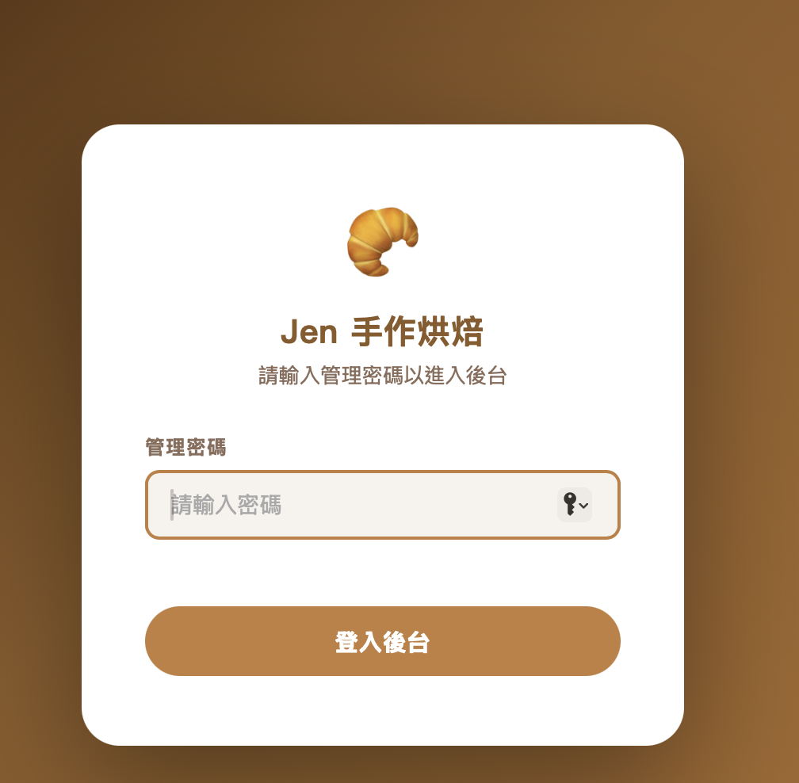
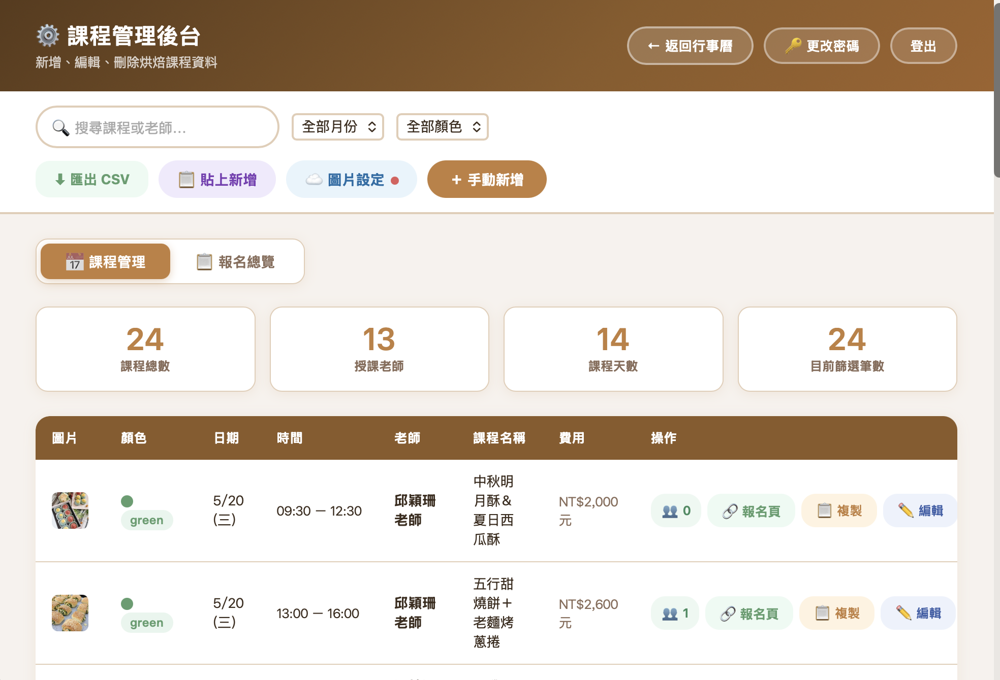
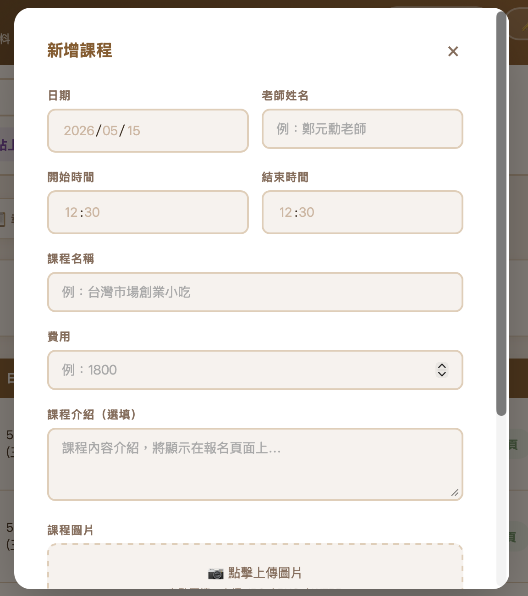
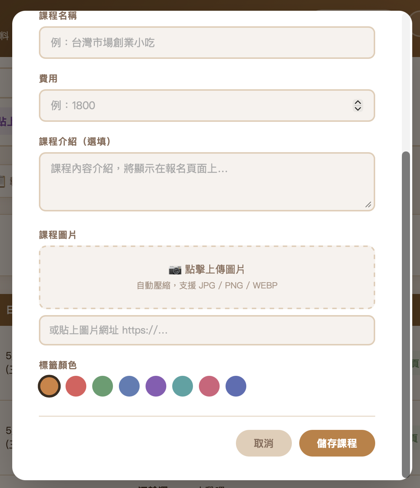
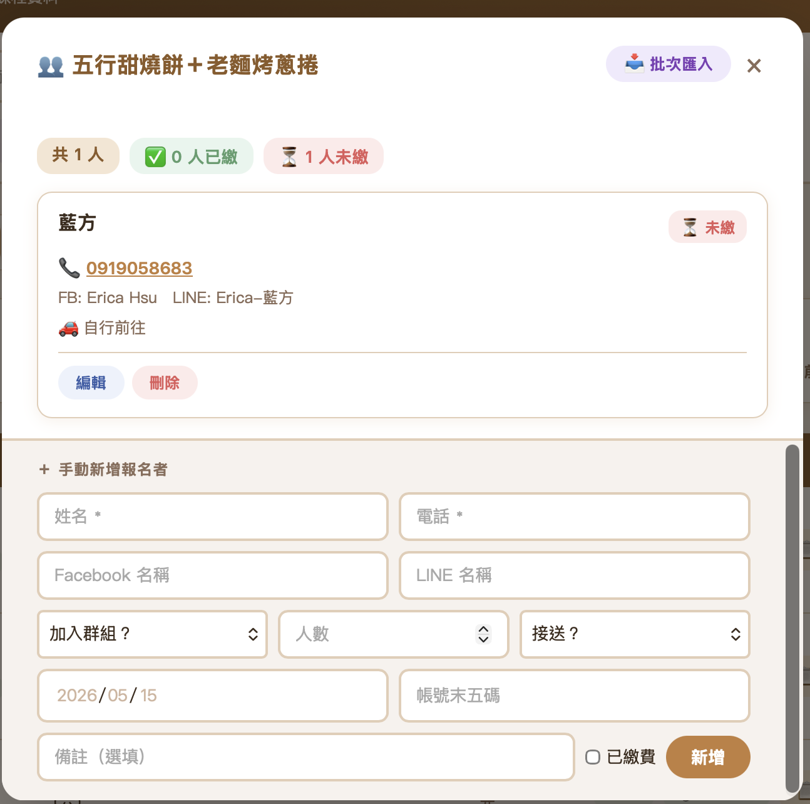

# Jen 手作烘焙後台操作手冊

---

## 目錄
1. [登入後台](#1-登入後台)
2. [課程管理](#2-課程管理)
3. [報名管理](#3-報名管理)
4. [複製報名連結](#4-複製報名連結)
5. [圖片設定](#5-圖片設定)
6. [修改密碼](#6-修改密碼)

---

## 1. 登入後台

開啟網址：`https://bakery.urland.com.tw/admin.html`



輸入管理密碼後按 **登入後台**。

> 💡 登入後系統會自動記住，下次開啟不需要重新輸入。手機和電腦都可以使用，每台裝置第一次需要輸入密碼。

---

## 2. 課程管理

登入後會看到課程管理主畫面，上方顯示課程總數、授課老師數等統計資訊。



### 新增課程

點右上角橘色的 **＋ 手動新增** 按鈕，會跳出新增表單。





依序填入：

| 欄位 | 說明 |
|------|------|
| **日期** | 選擇課程日期 |
| **老師姓名** | 例如「邱穎珊老師」 |
| **開始／結束時間** | 例如 09:30 / 12:30 |
| **課程名稱** | 會顯示在行事曆和報名頁面 |
| **費用** | 只輸入數字，例如 `1800` |
| **課程介紹** | 選填，會顯示在報名頁面 |
| **課程圖片** | 點虛線框上傳，或貼入圖片網址 |
| **標籤顏色** | 點選圓圈選擇顏色，用來區分不同類型課程 |

填好後點 **儲存課程**，系統會自動產生報名連結。

### 編輯課程

在課程列表找到要修改的課程，點 **編輯** 按鈕，修改完成後點 **儲存課程**。

### 刪除課程

點課程右側的 **刪除** 按鈕，確認後即刪除。

> ⚠️ 刪除課程不會同時刪除報名資料。

### 搜尋與篩選

- 左上搜尋框可依**課程名稱或老師名稱**搜尋
- 可依**月份**或**標籤顏色**篩選

---

## 3. 報名管理

點上方 **📋 報名總覽** 切換到報名頁面，可以看到每堂課的報名人數與繳費統計。

點 **查看名單** 即可看到該課程所有報名者。



### 報名卡片說明

每張卡片包含：
- 姓名
- 電話（點擊可直接撥打）
- FB / LINE 名稱
- 接送需求
- 匯款日期與帳號末五碼
- 備註
- 繳費狀態

### 標記繳費狀態

點卡片右上角的 **⏳ 未繳** 即可切換為 **✅ 已繳**，再點一次可切換回來。

### 手動新增報名者

在查看名單視窗的下方有「＋ 手動新增報名者」表單，填入姓名、電話等資料後點 **新增**。

### 編輯 / 刪除報名者

點卡片下方的 **編輯** 或 **刪除** 按鈕。

### 批次匯入報名名單

1. 點視窗右上角 **📥 批次匯入**
2. 從 Google 試算表複製資料後貼入，或直接輸入（每行一人，用空格或逗號分隔姓名、電話、備註）
3. 確認預覽後點 **匯入**

---

## 4. 複製報名連結

在課程列表中，點課程右側的 **📋 複製** 按鈕，剪貼簿會包含完整的課程資訊與報名連結：

```
【五行甜燒餅＋老麵烤蔥捲】
🗓 日期：5/20 (三)
⏰ 時間：13:00 – 16:00
👩‍🏫 老師：邱穎珊老師
💰 費用：NT$2,600 元

🔗 報名連結：https://bakery.urland.com.tw/register.html?id=xxx
```

直接貼到 LINE 群組或 Facebook 即可發布。

---

## 5. 圖片設定

課程圖片透過 Cloudinary 上傳。**第一次使用前需要先完成設定**，設定好之後就不需要再動。

1. 點上方工具列的 **☁️ 圖片設定**
2. 填入 **Cloud Name** 和 **Upload Preset**
3. 點 **儲存**
4. 按鈕旁的圓點變成綠色 🟢 表示設定成功

> 如果不確定 Cloud Name 和 Preset，請聯絡網站管理員。

---

## 6. 修改密碼

1. 點右上角 **🔑 更改密碼**
2. 輸入目前密碼
3. 輸入新密碼（至少 6 個字元）
4. 再次確認新密碼
5. 點 **儲存**

---

## 常見問題

**Q：登入後畫面是空的？**
請確認網路連線正常，系統需要連線才能載入資料。

**Q：圖片上傳失敗？**
請確認圖片設定已完成（按鈕旁是綠燈）。如果是紅燈，請重新填入 Cloudinary 設定。

**Q：忘記密碼怎麼辦？**
請聯絡網站管理員重設密碼。

**Q：在不同裝置都需要重新登入嗎？**
每台裝置第一次需要輸入密碼，之後會自動記住，不需要每次重新輸入。
